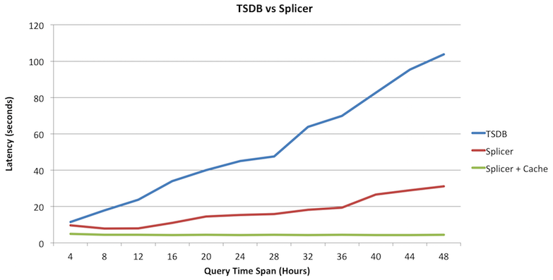
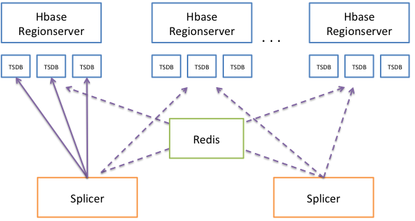

# Splicer: Faster Queries on TSDB

Splicer is a tool built at [Turn Inc](http://www.turn.com/) to quickly retrieve metrics from [TSDB](http://opentsdb.net/). TSDB is generally efficient at executing queries, but in our installation we found that for certain queries, especially those which contain many tag combinations or for very long time ranges, the average time to return results can be in order of few minutes or even tens of minutes. When you want metrics to diagnose issues quickly, this can be a long wait. 

Splicer attempts to solve this problem by slicing long range time intervals in queries into smaller chunks and parallely executing them on an array of TSDBs (as opposed to one). The results from these slices are cached in a Redis instance. Future queries on the same metrics are looked up from this cache, and hence can be much faster. Here is a graph showing the time taken by TSDB and Splicer (with and without caching) to retrieve results for a query with varying time ranges (4 hours to 48 hours).



## Design

TSDB stores its metrics in HBase. HBase is a persistent replicated distributed sorted map, where data is physically stored in [Region Servers](http://hbase.apache.org/0.94/book/regions.arch.html). TSDB has a [clever way](http://opentsdb.net/docs/build/html/user_guide/backends/hbase.html) to construct fixed size keys for the metrics it ingests. All data from the same metric are co-located with each other. More often than not, a query will find all its data points in a region.

Typically, the TSDB which executes a query is not co-located with the region server. This causes all the metric data to be sent over the network to the TSDB process. If this data set is large (we have noticed metric data of over 5 GB being transferred over the network per query), it will incur significant network resources. Moreover, downsampling and aggregating this stream will also be significant. If multiple queries are sent to this TSD, they will all compete for the same network and CPU resources. 

## Splicer

Splicer is used to overcome these performance issues with TSDB. Each TSDB query is sliced up into multiple pieces by time, and executed independently on different TSDs. We recommend co-locating multiple TSDBs with each region server in your HBase cluster (At Turn, we have around 10-12 TSDs per HBase node). For each slice, splicer can determine which region server holds the metrics, and execute that slice on a TSD available on that server. This reduces the network dependency, and also makes your query faster as data has to pass from one process to another across system memory. The returned results are stored in Redis (which acts as an LRU cache). This enables us to serve future queries faster. Also, the external cache gives us some redundancy across Splicer nodes. The returned results are _spliced_ together to form a final result before returning to the user.

The figure below shows the main architectural pieces of Splicer.



In order to over come these problems, we recommend using Splicer in the following manner: 

1. Co-locate an array of TSDBs with each region server in your HBase cluster.
2. Use one or more splicer nodes (atleast two is recommended) to receive your original TSDB queries.
3. Use a **shared** Redis cluster to cache the intermediate results so future queries are faster.
4. Use Splicer on always-running dashboards ([Grafana](http://grafana.org/), for instance) which lookup multi-day or week long plots.

## Configuration

You can configure splicer with the following options. An example config can be found at src/main/resources/splicer.conf.

```
## the port on which the splicer listens for HTTP requests
splicer.port = 4245
```

Use the following config to tell Splicer which hosts are running the TSDs, and which ports they are listening on. In this example, there are 3x3 = 9 TSDs available for splicer to delegate queries to.

```
## hosts on which the TSDs are running
tsd.hosts = data001.turn.com,data2.atl2.turn.com,data3.atl2.turn.com

## start and end port for TSDs on data nodes. Start is inclusive, End is exclusive
tsd.start.port = 4242
tsd.end.port = 4245
```

By default, each query slice is sent to one host:port combination. To increase this number, use the following config. This is also useful if you have a load balancer between Splicer and the query nodes. Saves you the trouble of changing the config each time a TSD goes down.

```
tsd.queries.per.port = 10
```

Enable overflow for slices. In order to query our splices, we read more data than what is needed for that time interval (so we get correct results on the boundaries of that slice). In order to grab a bigger chunk of data (1 hour before and 1 hour after), enable this setting:
```
## enable overflow for slices
slice.overflow.enable = false
```

To enable redis caching, and provide it the host and port details for the redis server:
```
## is redis caching enabled (disable this flag if Redis is not available)
caching.enabled = true

## redis host:port setups for
caching.hosts = 172.17.42.1:6379
```

Tell Splice where the HBase Zookeeper is:
```
## hbase configuration
hbase.zookeeper.quorum = hbase-zk.turn.com,hbase-zk.turn.com,hbase-zk.turn.com
hbase.znode.parent = /hbase
```

## Running Splicer

After setting up the different TSDs along with the Hbase Region Server, run the main class to run Splicer fom (SplicerMain)[https://stash.turn.com/projects/REPORT/repos/tsdb-splicer/browse/src/main/java/com/turn/splicer/SplicerMain.java].

You also can use the docker scripts provided in the `docker` directory to build and run containers.

## Applying Functions on Time Series

Besides executing regular TSDB functions, Splicer also gives you the ability to run different functions on TSDB results. For example, you can add two time series, create a new time series which is the sum of two time series divided by a third one. We provide the following functions as of now.

### SUM 

Sum two time series 

```
sum(sum:1m-avg:proc.stat.cpu.percpu{cpu=1},sum:1m-avg:proc.stat.cpu.percpu{cpu=2})
```

### DIFFERENCE

Substract the second series from the first

```
difference(sum:1m-avg:proc.stat.cpu.percpu{cpu=1},sum:1m-avg:proc.stat.cpu.percpu{cpu=2})
```

### MULTIPLY

Multiply two time series

```
multiply(sum:1m-avg:proc.stat.cpu.percpu{cpu=1},sum:1m-avg:proc.stat.cpu.percpu{cpu=2})

```

### DIVIDE

Takes two series and divide the first one with the second.

```
divide(sum:1m-avg:proc.stat.cpu.percpu{cpu=1},sum:1m-avg:proc.stat.cpu.percpu{cpu=2})
```

### MOVING AVERAGE

The moving average of a metric over a fixed number of past points, or a time interval.	

```
// average over last 10 points
movingAverage(sum:1m-avg:proc.stat.cpu.percpu{cpu=1}, 10) 

// average over last 1 min
movingAverage(sum:1m-avg:proc.stat.cpu.percpu{cpu=1}, '1min') 
```

### HIGHEST CURRENT

Takes one metric or a wildcard seriesList followed by an integer N. Out of all metrics passed, return only the N metrics with the highest value at the end of the time period specified.

```
// find the top two metrics which have the highest values at the end of the time period specified.
highestCurrent(sum:1m-avg:proc.stat.cpu.percpu{cpu=1|2|3|4}, 2) 

```

### HIGHEST MAX

Takes one metric or a wildcard seriesList followed by an integer N. Out of all metrics passed, return only the N metrics with the highest maximum value in the time period specified.


```
// find the top two metrics which have the highest maximum anywhere in the end of the time period specified.
highestMax(sum:1m-avg:proc.stat.cpu.percpu{cpu=1|2|3|4}, 2) 

```

### SCALE

Takes one metric or a wildcard seriesList followed by a constant, and multiplies the datapoint by the constant provided at each point.

```
// multiply each datapoint value with 10
scale(avg:1m-avg:proc.stat.cpu.percpu{cpu=1},10) 

// multiply each datapoint value with 0.0001
scale(avg:1m-avg:proc.stat.cpu.percpu{cpu=1},0.0001) 
```

### ALIAS

Takes one metric or a wildcard seriesList and a string. Returns the string instead of the metric name in the legend.

```
// quotes not needed around cpu_1
alias(avg:1m-avg:proc.stat.cpu.percpu{cpu=1},cpu_1) 

// every instance of @cpu will be replaced by the value of the tag "cpu".
alias(avg:1m-avg:proc.stat.cpu.percpu{cpu=1},@cpu) 
```

### ABSOLUTE

Take one or metrics and apply the absolute function to every data point in it.	

```
absolute(avg:1m-avg:proc.stat.cpu.percpu{cpu=1}).

// scale each value by -1 and then return their absolute value
absolute(scale(sum:1m-avg:rate:proc.stat.cpu.percpu{cpu=*},-1)) 
```

An example curl command to run such a function on Splicer: 


## Running commands:

Splicer does its best to mimic TSDB's 1.x Query API. For example, you can run a curl command against Splicer: 

```
curl 'http://splicer.host.com/splicer/api/query' --data-binary '{"start":1473715620025,"queries":[{"metric":"proc.stat.cpu.percpu","aggregator":"sum","rate":true,"rateOptions":{"counter":false},"downsample":"10m-max","tags":{}}]}'
```

In order to run function expressions, pass in the entire expression in the HTTP Query string (with param name 'x')

```
curl 'http://splicer.host.com/api/query/query?start=1473715143790&x=absolute(scale(sum:1m-avg:rate:proc.stat.cpu.percpu{cpu=*},-1))'
```